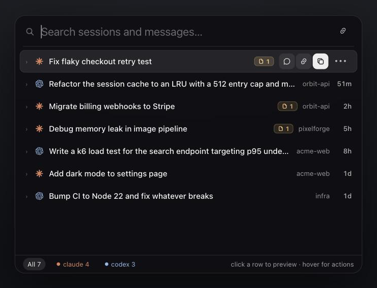
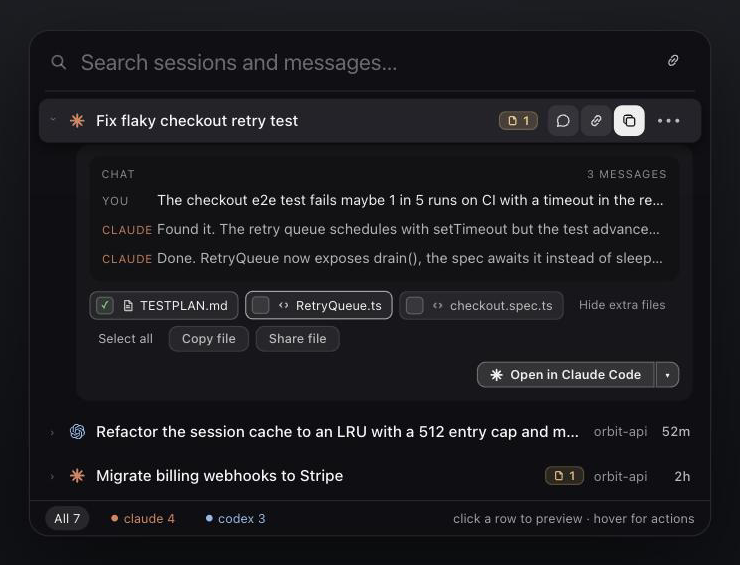
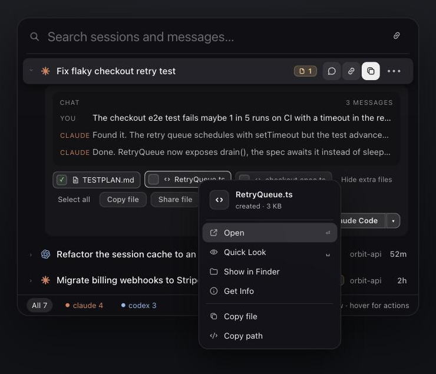
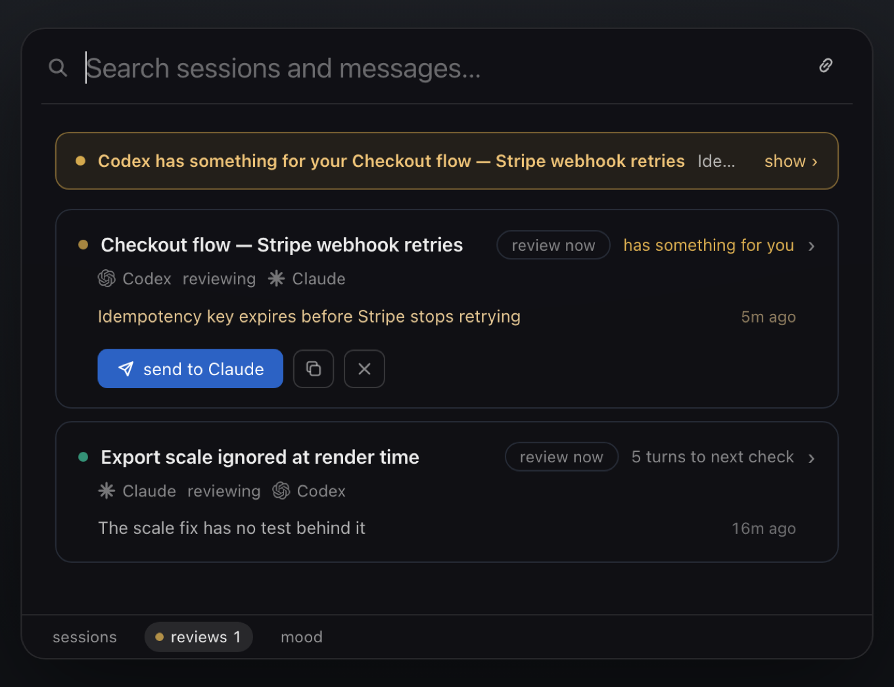
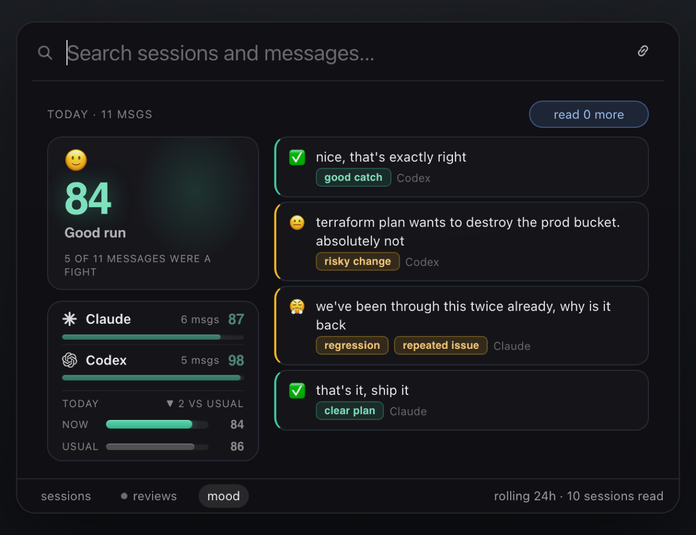

<h1 align="center">Share-It</h1>

<p align="center">
  <b>Get a shareable link to any AI-coding session — in one click.</b>
</p>

<p align="center">
  <a href="https://github.com/FlowAILab/share-it/releases/latest/download/Share-It.dmg">
    <b>⬇︎  Download for macOS</b>
  </a>
  &nbsp;·&nbsp; Drag to Applications, press <b>⌥S</b>. No setup, no account.
</p>

<p align="center">
  
  
  
</p>

<p align="center">
  
</p>

<p align="center">
  
  
</p>

<p align="center">
  
  
</p>

---

Share-It indexes every **AI agent session** on your Mac — Claude Code, Codex, Cursor,
and [eight more](#works-with) — into one fast, local search. Find any chat, then hand it
off in a keystroke: as context for another agent, a hosted link for a teammate, or the
finished files themselves.

It also watches the work while it happens: a [second model reviewing](#a-second-model-watching-the-work)
your live sessions, and a [read on how the day is actually going](#how-the-day-actually-went).

## Install

**Requires** macOS 13+. Nothing else — Python is bundled in the DMG.

1. [Download the DMG](https://github.com/FlowAILab/share-it/releases/latest/download/Share-It.dmg)
   and drag **Share-It** into **Applications**.
2. **First launch: right-click the app → Open → Open.** Double-clicking will not
   work. See [Gatekeeper](#gatekeeper-the-app-is-not-notarized) below.
3. Press **⌥S** (Option + S) — the palette opens over whatever you're doing.
   Type to find a session. **⏎** copies its context, **⌘L** makes a link,
   **⌘R** sends the result.

> The published DMG is **v2.0.0**. The reviewer and mood tabs landed after it —
> [build from source](#build-from-source) for those until the next release.

### Gatekeeper: the app is not notarized

Share-It is signed but **not notarized by Apple** (notarization needs a paid
Developer ID). macOS therefore refuses the first launch of a double-click.

- **Right-click → Open → Open** in the dialog. macOS remembers the choice; every
  launch after that is normal.
- If you get *"Share-It is damaged and can't be opened"*, the quarantine flag is
  set. Clear it once:
  ```bash
  xattr -dr com.apple.quarantine /Applications/share-it.app
  ```
- macOS 15+ may route you through **System Settings → Privacy & Security**, where
  a **Open Anyway** button appears after the first blocked attempt.

### Permissions it will ask for, and why

Share-It asks for nothing at install. Prompts appear the first time you use a
feature that needs one, and **every one of them is safe to decline** — you lose
that one capability, not the app.

| Prompt | Triggered by | If you decline |
|---|---|---|
| **Desktop / Documents / Downloads** | A session wrote a file there and you asked to copy, preview or share it | Files in that folder aren't offered; everything else works |
| **Automation → Finder** | *Show in Finder*, *Get Info* | Those two menu items do nothing |
| **Automation → Terminal / iTerm** | *Open where you left off* | Reopening a session in your terminal fails |
| **Notifications** | Only if you turn on a **reviewer** | Reviews still run; they just don't interrupt you |

Share-It does **not** need Accessibility — the **⌥S** hotkey uses Carbon's
`RegisterEventHotKey`, not event monitoring — and it does **not** need Full Disk
Access. It reads the session folders your AI tools already write to
(`~/.claude`, `~/.codex`, and the rest) plus its own `~/.shareit`.

If you deny something and change your mind: **System Settings → Privacy &
Security → Files and Folders** (or **Automation**), find Share-It, toggle it on.

### Reviewer and mood need your own CLI

Both features shell out to the `claude` and `codex` you already have on your
`PATH`, under your own account and limits. If a CLI isn't installed the feature
stays idle — nothing breaks, and neither runs until you turn it on.

## One keystroke per job

- 🧠 **Copy context** — **⏎**. The whole session — every prompt, response, and **tool
  call with its output** — on your clipboard, ready for another agent. Small sessions
  paste inline; big ones become an immutable on-disk bundle plus a short handoff prompt,
  so a huge transcript never floods the next agent's context. Pasted screenshots ride
  along as real references.
- 🔗 **Share link** — **⌘L**. The same full context as a hosted page, for a teammate or
  an agent on another device. Paths become basenames; your username never leaves your Mac.
- 📣 **Send result** — **⌘R**. The files the session produced, ready to attach: paste
  into Slack, Mail, or Finder and they land as real attachments. **⌥⌘R** copies the
  final answer as a clean message to go with them.
- 📦 **Copy files** — **⇧⌘C**. Exactly the files you've check-marked in the session
  card — PDFs, images, code — straight into Finder or a chat.

> **Why not just `/export`?** Claude's export ships the rendered scrollback — no tool
> output, images reduced to `[Image #N]`. Share-It reads the raw session, so the
> receiving agent gets the real work.

## A second model, watching the work

Point Share-It at a live session and the *other* model reviews it as it runs — Codex
reads your Claude sessions, Claude reads your Codex ones. It looks every 5 agent turns,
never more often than every 5 minutes, and keeps its own notes between checks.

- 🔍 **Watch any session** — from the **Reviews** tab. The reviewer gets its own thread
  and its own memory of what it has already raised, so it argues with the work, not
  with itself.
- 🚨 **Only "fix it now" interrupts** — severity runs 0–3. A **3** means the next real
  step is unsafe until it is fixed; only a 3 earns a banner and a sound. A **2** is
  "fix eventually" — recorded and carried forward, never a notification.
- 🧾 **Nothing gets re-discovered, nothing gets dropped** — every check receives the
  still-open list and must either settle each item with evidence or leave it open. It
  cannot quietly re-file the same finding an hour later, and it cannot forget the one
  you never got around to.
- ✉️ **Act on it** — copy a finding, or send it straight into the session under review
  as a message that agent will read mid-task.

<p align="center">
  
</p>

## How the day actually went

One number for your day, computed from **your** messages — not the agent's.

- 😤 **A single score** — your messages classified by a small model (Haiku 4.5), then
  scored so friction costs outright instead of being averaged away. One bad stretch
  shows up; a calm afternoon does not cancel it.
- 📅 **Resets at your midnight** — a real local calendar day, from transcript
  timestamps. Agent-written transcripts and machine-injected turns (hook feedback,
  a reviewer interrupting you) are excluded — you did not type them.
- 💬 **The receipts** — the messages behind the number, today's first, each labelled
  with what went wrong. Click one for the reason, or jump to the session.
- 📈 **Versus usual** — today against the fortnight behind it, scored the same way, so
  the comparison means something.

<p align="center">
  
</p>

## Nice extras

- ⚡ **Deep mode** — **⌘D** adds reasoning and full, untruncated tool output to Copy
  context and Share link, for a maximally faithful handoff.
- 🗂 **Files are first-class** — click a file to preview, double-click to open,
  right-click for Open / Quick Look / Show in Finder / Get Info / Copy path.
- ↩︎ **Open where you left off** — one key reopens the session in Claude Code or Codex,
  in the terminal you prefer (pick Warp once, it sticks).
- 🛟 **Nothing gets lost** — Claude wipes old sessions after ~30 days; Share-It quietly
  keeps them, and lets you search everything you've ever done.
- ⏳ **Your rules** — share links last forever or 1 / 3 / 7 days (set it in the **⌘K**
  menu), and vanish in one click.

## Works with

Share-It indexes every AI-coding session on your Mac — no config, it just finds them:

| | Client | Where it reads |
|---|---|---|
| 🌸 | **Claude Code** | CLI · desktop · the VS Code extension (same store) |
| 🟣 | **Cowork** | Claude desktop agent mode |
| ⬛ | **Codex** | CLI · desktop |
| ▦ | **Cursor** | editor chat + composer |
| ▶ | **Continue** | VS Code / JetBrains extension |
| ⚡ | **Cline** &amp; **Roo Code** | VS Code task history |
| 🤖 | **GitHub Copilot Chat** | VS Code chat sessions |
| 🧭 | **OpenCode** | terminal agent |
| 🪿 | **Goose** | terminal agent |
| π | **Pi** | terminal coding agent |

New client? It's one small file in [`adapters.py`](adapters.py) — PRs welcome.
*(Cloud-only tools like ChatGPT keep no local transcript, so they can't be indexed.)*

## 🔒 Yours, always

- **Local by default** — nothing leaves your Mac until you hit **Share link**. Copy
  context and Send result stay on-device, and clipboard writes are host-only (they never
  ride Universal Clipboard to your other devices).
- **Reviews and mood use your own CLIs** — both shell out to the `claude` and `codex`
  you already have installed, under your own account and your own limits. No key is
  asked for, no transcript is sent anywhere Share-It chose. Neither feature runs until
  you turn it on.
- **Never used for training** — your sessions stay yours, on your own storage.
- **Scrubbed** — transcript text is always checked for common secret patterns; hosted
  links additionally strip absolute paths and your username.
- **Files ship as-is** — glance at what's check-marked before you send.
- **Links you control** — public but unguessable, expire on your schedule, deleted in
  one click.

## Build from source

```bash
./macos/build.sh          # → ~/Applications/share-it.app
```

Tiny local app (Python + a native panel). Shares go to a Cloudflare R2 worker
(`worker/`). Adding a new tool? One small class in `adapters.py`.

<sub>MIT licensed · built by <a href="https://github.com/FlowAILab">FlowAILab</a></sub>
